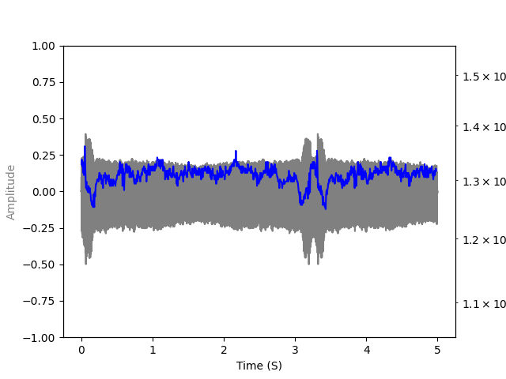

# MacRes - short for Mac Resampler

Fork of https://github.com/ohac/tn_fnds.

This is an executable designed to be called by https://github.com/titinko/utsu (UTSU).
Despite the name, it can be compiled for Windows, Mac, or Linux using the Makefile.

The Windows/Linux versions of this resampler can also be used with the UTAU program:
https://en.wikipedia.org/wiki/Utau.


# Compilation

To build macres just do
```
cd src
make
```


# Use

```
macres inputfile outputfile notenum [velocity flags offset_ms notelength fixedlength end intensity modulation tempo pitchbends]
```

* Inputfile: Wav input file
* Outputfile: Wav output file
* notenum: Pitch to resample. Could use C0-B7 . Use C# or Db for flat and bemol.
* velocity: Consonant velocity, in percent. 100 uses the original length, 50 half time, 200 double velocity
* Flags: Use ? for no flags
  * B0 - B100 : Breath . Default=50
  * b0 - b100 : Consonant strength. Default=0
  * t<XXX> : transpose XXX/120 semitones. For example, t120 traspose the note +1oct. 
  * g-100 - g100 : Gender flag
  * W-1 unvoiced W0 no effect W50-5000 frequency enforcement
  * A0 - A100: Correct volume of combined
  * O0 - O100: Voice strength. Change the voice "brightness". Specifying + values suppresses lower frequencies and amplifies higher one
  * e : Change the vowel stretching method
* Offset: Offset to start the note in ms 
* Note length: Total note duration in ms
* Fixed Length: Consonant section in ms. Not used on loop when we extend the note 
* End: Offset from the end of the file to remove.
* Intensity: Volume of the note. 100 is same as original
* Modulation: Variations around the f0. 0=no modulation, perfect tone (autotune-like). 100= original modulations around the average f0. 200= double of modulation around the average.
* Temp: Tempo of the song, on BPM. By default, 120. Should be prepended by 'T'

# Example

Use the file 'mam.wav' in *assets* dir as example. Is mainly a C3 (130.81 Hz), with some problems of tuning at the first and last 'm'. The useful part of the note is between 750 ms and 2500ms.
Note the differences on amplitude of consonants and vowels, created to help to understand the changes of the resampler.


A fairly vanilla setting, with a 5000ms note, 100% velocity of consonant, 100% volume, 100% of original modulation and taking off the noise will be:
```
macres assets/mam.wav test.wav C3 100 ? 750 2000 200 1250 100 100
```


Note the 200ms for the consonant. If we remove the consonant, the consonant will be played again when original sample length is shorter than required note:

```
macres assets/mam.wav test.wav C3 100 ? 750 5000 000 1250 100 100
```



To generate a perfect pitch, we could set modulation to 0:
```
macres assets/mam.wav test.wav C3 100 ? 750 5000 200 1250 100 0
```


# Implementation

This resampler uses the  [World](https://github.com/mmorise/World) library to implements the synthesis.
Specifically, uses some (relatively old) specs:

* DIO: estimate F0 contour
* Platinum: Method to extract excitation signals for voice synthesis system based on PLATINUM

